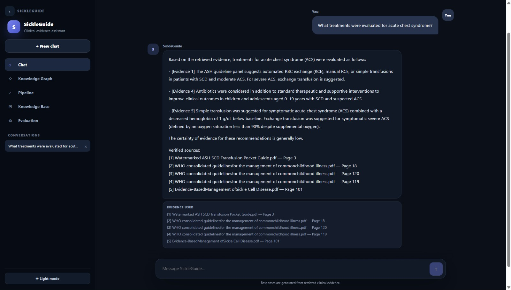
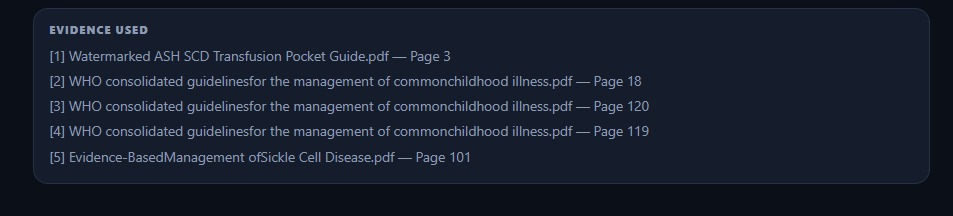
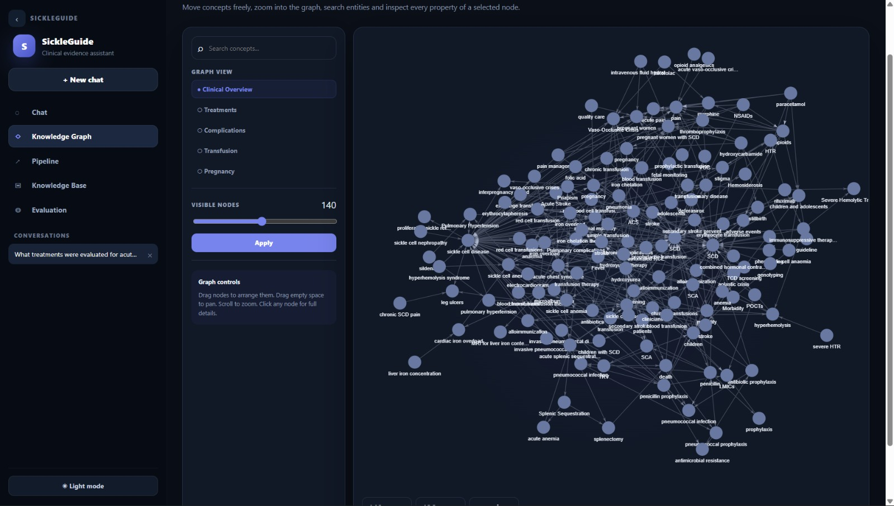
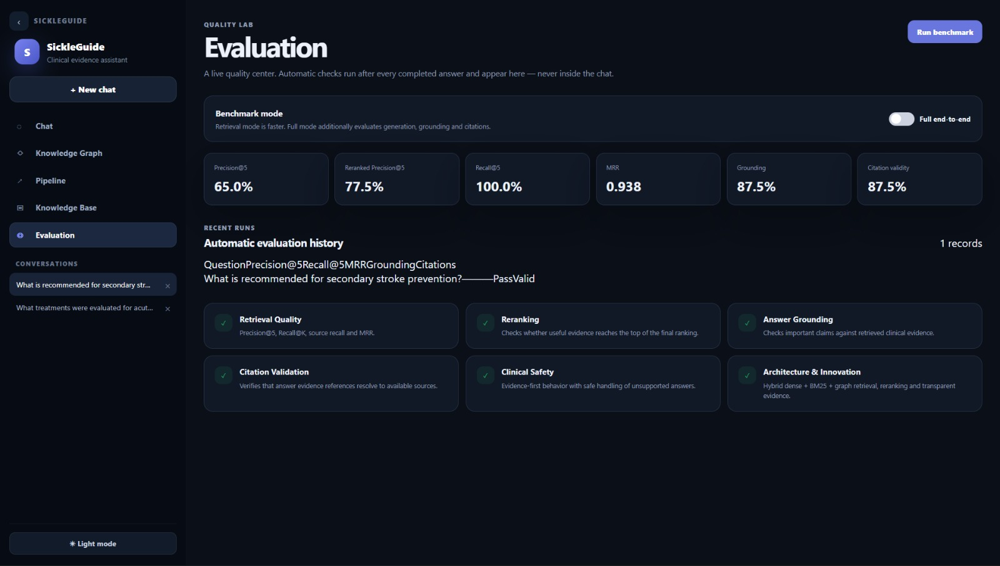
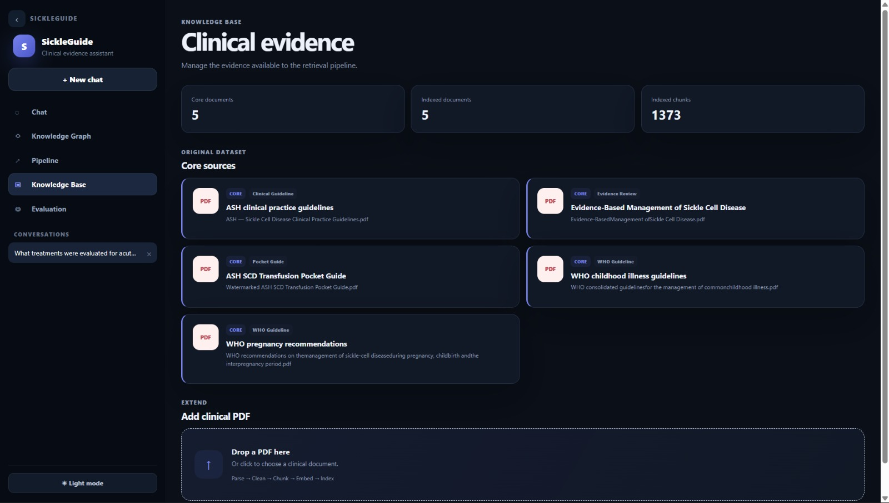

# 🩺 SickleGuide

### Evidence-Grounded Clinical AI Assistant for Sickle Cell Disease

> **From medical evidence to grounded, traceable answers.**

SickleGuide is a full-stack clinical AI assistant designed to help users explore **Sickle Cell Disease (SCD)** information from a controlled medical knowledge base.

Instead of relying only on unsupported LLM knowledge, SickleGuide combines **hybrid retrieval, Knowledge Graph retrieval, reranking, evidence fusion, grounded generation, citation validation, safety checks, and conversation memory** to produce evidence-grounded answers.

> ⚠️ **SickleGuide is an educational and research aid. It does not diagnose patients or replace qualified healthcare professionals.**


##  Screenshots

###  Clinical Chat



###  Evidence & Citations



###  Knowledge Graph



###  Evaluation



###  Knowledge Base



---

#  What is SickleGuide?

Medical guidelines contain valuable clinical evidence, but finding the right information inside large documents can be difficult and time-consuming.

SickleGuide addresses this problem by building an end-to-end pipeline:

```text
Medical Guidelines
        ↓
Document Ingestion
        ↓
Cleaning & Markdown Conversion
        ↓
Section-Aware Chunking
        ↓
Metadata Enrichment
        ↓
┌───────────────┬───────────────┬───────────────┐
│ Dense Search  │  BM25 Search  │ Graph Search  │
│    BGE-M3     │    Lexical    │ Knowledge     │
│               │               │ Graph         │
└───────────────┴───────────────┴───────────────┘
                        ↓
                  Hybrid Retrieval
                        ↓
                       RRF
                        ↓
                    Reranking
                        ↓
                  Final Evidence
                        ↓
               Grounded LLM Answer
                        ↓
             ┌──────────┴──────────┐
             ↓                     ↓
      Grounding Review      Citation Validation
             └──────────┬──────────┘
                        ↓
                Safety Checks
                        ↓
              Final Answer + Sources
                        ↓
                 FastAPI Backend
                        ↓
                  React Frontend
```

---

#  The Problem

## Scattered Information

Medical evidence is distributed across large clinical guidelines and documents.

## Search Limitations

Traditional keyword search may miss relevant evidence when the user's wording differs from the wording used in the source.

## Time-Consuming Retrieval

Finding the right evidence manually can require searching through large documents.

## LLM Hallucinations

A general-purpose LLM can generate plausible but unsupported information.

## Lack of Traceability

Clinical information should be connected to the evidence supporting it.

---

#  Our Solution

SickleGuide combines multiple retrieval and verification techniques into one system:

*  Dense semantic retrieval
*  BM25 lexical retrieval
*  Knowledge Graph retrieval
*  Reciprocal Rank Fusion (RRF)
*  BGE reranking
*  Evidence fusion
*  Grounded LLM generation
*  Claim/evidence grounding review
*  Citation validation
*  Clinical safety checks
*  Conversation memory
*  Streaming responses
*  Evaluation metrics
*  Full-stack web interface

---

#  System Architecture

```text
                         ┌──────────────────────┐
                         │   Medical Documents  │
                         │      / PDFs          │
                         └──────────┬───────────┘
                                    ↓
                         ┌──────────────────────┐
                         │  Document Ingestion  │
                         │ Loading / Cleaning   │
                         │ Markdown Conversion │
                         │ Chunking / Metadata  │
                         └──────────┬───────────┘
                                    ↓
             ┌──────────────────────┼──────────────────────┐
             ↓                      ↓                      ↓
       ┌───────────┐          ┌───────────┐          ┌───────────┐
       │  BGE-M3   │          │   BM25    │          │   Graph   │
       │   Dense   │          │  Search   │          │ Retrieval │
       └─────┬─────┘          └─────┬─────┘          └─────┬─────┘
             └──────────────────────┼──────────────────────┘
                                    ↓
                           ┌────────────────┐
                           │ Hybrid + RRF   │
                           └───────┬────────┘
                                   ↓
                           ┌────────────────┐
                           │ BGE Reranker   │
                           └───────┬────────┘
                                   ↓
                           ┌────────────────┐
                           │ Final Evidence │
                           └───────┬────────┘
                                   ↓
                           ┌────────────────┐
                           │ Qwen2.5:7B     │
                           │ Grounded LLM   │
                           └───────┬────────┘
                                   ↓
                    ┌──────────────┴──────────────┐
                    ↓                             ↓
             Grounding Review              Citation Validation
                    └──────────────┬──────────────┘
                                   ↓
                           ┌────────────────┐
                           │ Safety Checks  │
                           └───────┬────────┘
                                   ↓
                       ┌─────────────────────┐
                       │ Answer + Evidence  │
                       │ + Citation Status  │
                       └──────────┬──────────┘
                                  ↓
                         ┌─────────────────┐
                         │ FastAPI Backend │
                         └────────┬────────┘
                                  ↓
                         ┌─────────────────┐
                         │ React + Vite UI │
                         └─────────────────┘
```

---

#  Retrieval Pipeline

SickleGuide uses **three complementary retrieval strategies**.

### 1. Dense Retrieval — BGE-M3

Captures semantic similarity between the user's query and medical evidence.

### 2. BM25 Retrieval

Captures lexical and exact-term similarity.

This is particularly useful when specific medical terminology appears in the source.

### 3. Knowledge Graph Retrieval

Uses relationships between entities and evidence to provide an additional retrieval path.

### 4. Reciprocal Rank Fusion

The three retrieval results are combined using **RRF** to create a unified candidate ranking.

### 5. Reranking

Candidate evidence is reranked using:

**BAAI/bge-reranker-v2-m3**

The final evidence set is then passed to the generation stage.

---

#  Knowledge Graph

The Knowledge Graph provides a second reasoning path beyond traditional vector retrieval.

It supports:

* Entity relationships
* Relationship exploration
* Node metadata
* Interactive visualization
* Graph-based evidence retrieval

### Graph flow

```text
Medical Documents
       ↓
Entity / Relationship Extraction
       ↓
Knowledge Graph
       ↓
Graph Retrieval
       ↓
Relevant Evidence
```

The frontend allows users to:

* Drag and explore the graph
* Zoom and pan
* Select nodes
* Inspect metadata
* Explore relationships

---

#  Grounded Generation

SickleGuide currently uses:

**Qwen2.5:7B**

through:

**Ollama**

The model does not receive the user query alone.

Instead:

```text
User Query
    +
Retrieved Evidence
    ↓
Grounded Prompt
    ↓
Qwen2.5:7B
    ↓
Answer
```

This encourages the model to base its response on retrieved evidence rather than unsupported knowledge.

---

#  Grounding Review

After generation, SickleGuide performs a grounding review.

The system checks whether important claims in the generated response are supported by the retrieved evidence.

```text
Generated Answer
       ↓
Grounding Review
       ↓
Supported?
   ↙       ↘
 Yes        No
  ↓          ↓
Continue   Safety / Retry Flow
```

This adds a verification layer after generation instead of blindly returning the LLM output.

---

#  Citation Validation

SickleGuide maintains a connection between the answer and its supporting evidence.

The citation layer validates the available evidence references and exposes source information to the user.

Each source can include:

* Source document
* Page number
* Citation
* Evidence identifier
* Reranker score when available

This makes the answer **traceable back to the evidence**.

---

#  Clinical Safety

Because the system operates in a medical domain, safety is treated as a core architectural component.

SickleGuide is designed around:

* Evidence-first responses
* Grounding checks
* Citation validation
* Uncertainty handling
* Safe failure behavior
* Clinical safety checks

The system is intended for **education, research, and evidence exploration**, not individualized diagnosis or treatment decisions.

---

#  Conversation Memory

SickleGuide supports multi-turn conversations.

A conversation is associated with a `chat_id`, allowing the system to preserve recent conversation context.

```text
User
 ↓
Question
 ↓
Conversation Memory
 ↓
RAG Pipeline
 ↓
Grounded Answer
 ↓
Updated Memory
```

This allows follow-up questions to be understood in the context of previous messages.

---

#  Streaming Responses

The chat API supports streaming-style responses.

The frontend can receive processing stages such as:

```text
Searching clinical evidence...
        ↓
Ranking relevant evidence...
        ↓
Generating an evidence-grounded answer...
        ↓
Grounding review
        ↓
Sources
        ↓
Final response
```

This makes the interaction feel more responsive and transparent.

---

#  Knowledge Base

Users can upload PDF documents through the Knowledge Base interface.

The ingestion workflow performs:

```text
PDF
 ↓
Loading
 ↓
Cleaning
 ↓
Markdown Conversion
 ↓
Chunking
 ↓
Metadata Enrichment
 ↓
Vector Indexing
 ↓
Runtime Retriever Refresh
```

Uploaded chunks become available to dense and BM25 retrieval.

> If new documents also introduce graph entities or relationships, the graph index should be rebuilt or refreshed according to the deployment workflow.

---

#  Evaluation

Evaluation is not limited to checking whether the final answer looks good.

SickleGuide evaluates different parts of the pipeline.

## Retrieval Quality

The evaluation pipeline includes retrieval-oriented metrics such as:

* Precision@K
* Recall@K
* Reciprocal Rank / MRR

These evaluate whether relevant evidence is retrieved and ranked effectively.

## Grounding & Faithfulness

The system also evaluates:

* Grounding status
* Citation validity
* Evidence support
* Answer quality

## Live Evaluation

For labeled benchmark questions, the chat pipeline can expose:

```text
Precision@5
Recall@5
MRR
Grounded
Citations Valid
Evidence Count
```

For arbitrary user questions that are not part of the labeled benchmark dataset, benchmark retrieval metrics are not artificially calculated.

---

#  Evaluation Loop

```text
Evaluation Dataset
        ↓
Run Retrieval
        ↓
Measure Precision / Recall / MRR
        ↓
Analyze Weak Retrieval
        ↓
Tune Pipeline
        ↓
Evaluate Again
```

This allows evaluation to become part of the development process rather than a final afterthought.

---

#  Full-Stack Application

SickleGuide is implemented as a complete application rather than only a RAG script.

```text
React + Vite
     ↓
FastAPI REST API
     ↓
RAG Engine
     ↓
Retrieval + Graph
     ↓
Reranking
     ↓
LLM Generation
     ↓
Grounding + Safety
     ↓
Evidence + Citations
```

### Frontend

* Chat interface
* Conversation history
* Evidence display
* Citation status
* Grounding status
* Knowledge Base
* Knowledge Graph
* Evaluation interface
* Light/Dark mode

### Backend

FastAPI routes cover the main application capabilities, including:

* Chat
* Search
* Graph
* Data
* Evaluation
* Health

---

#  Technology Stack

| Layer             | Technology                 |
| ----------------- | -------------------------- |
| Frontend          | React + Vite               |
| Backend           | FastAPI                    |
| LLM               | Qwen2.5:7B                 |
| LLM Runtime       | Ollama                     |
| Embeddings        | BAAI/bge-m3                |
| Reranker          | BAAI/bge-reranker-v2-m3    |
| Vector Database   | Chroma                     |
| Lexical Retrieval | BM25                       |
| Retrieval Fusion  | RRF                        |
| Graph Retrieval   | Knowledge Graph            |
| PDF Processing    | PyMuPDF4LLM / OCR          |
| Evaluation        | Precision@K, Recall@K, MRR |
| Containerization  | Docker / Docker Compose    |

---

#  Project Structure

```text

SickleGuide/
│
├── api/
│   ├── main.py
│   └── routes/
│       ├── chat.py
│       ├── data.py
│       ├── evaluation.py
│       ├── graph.py
│       ├── health.py
│       └── search.py
│
├── frontend/
│   ├── src/
│   ├── package.json
│   └── ...
│
├── src/
│   ├── chunking/
│   ├── evaluation/
│   ├── generation/
│   ├── graph/
│   ├── ingestion/
│   ├── memory/
│   └── retrieval/
│
├── data/
│   ├── raw/
│   └── processed/
│
├── docs/
│   └── images/
│       ├── chat.jpeg
│       ├── evaluation.jpeg
│       ├── evidence.jpeg
│       ├── graph.jpeg
│       └── knowledge-base.jpeg
│
├── scripts/
├── tests/
│
├── .env.example
├── .gitignore
├── requirements.txt
├── Dockerfile
├── docker-compose.yml
├── run.py
└── README.md


```

---

#  Getting Started

## 1. Clone the Repository

```bash
git clone https://github.com/Nasser-10/SickleGuide.git
cd SickleGuide
```

---

## 2. Create a Virtual Environment

### Windows

```powershell
python -m venv .venv
.venv\Scripts\activate
```

### macOS / Linux

```bash
python3 -m venv .venv
source .venv/bin/activate
```

---

## 3. Install Dependencies

```bash
pip install -r requirements.txt
```

---

## 4. Configure Environment

### Windows

```powershell
copy .env.example .env
```

### macOS / Linux

```bash
cp .env.example .env
```

Adjust the configuration according to your environment.

---

#  Ollama Setup

SickleGuide currently uses Ollama for local LLM generation.

Install Ollama and make sure the Ollama service is running.

Then pull the configured model:

```bash
ollama pull qwen2.5:7b
```

Default configuration:

```env
LLM_MODEL=qwen2.5:7b
LLM_BASE_URL=http://localhost:11434
```

---

#  Run the Backend

From the repository root:

```bash
uvicorn api.main:app --reload
```

Backend:

```text
http://localhost:8000
```

API documentation:

```text
http://localhost:8000/docs
```

---

#  Run the Frontend

Open a second terminal:

```bash
cd frontend
npm install
npm run dev
```

The Vite development server normally runs at:

```text
http://localhost:5173
```

---

#  Health Check

Verify that the backend is running:

```text
http://localhost:8000/api/v1/health
```

---

#  Docker

The project includes Docker configuration.

Run:

```bash
docker compose up --build
```

The current Compose configuration exposes the backend on port `8000` and the frontend container on port `3000`.

Ollama is normally run separately unless explicitly configured as part of the deployment.

---

#  Configuration

Important environment variables include:

| Variable            | Purpose                  | Default                        |
| ------------------- | ------------------------ | ------------------------------ |
| `LLM_MODEL`         | Ollama generation model  | `qwen2.5:7b`                   |
| `LLM_BASE_URL`      | Ollama endpoint          | `http://localhost:11434`       |
| `LLM_TEMPERATURE`   | Generation temperature   | `0.0`                          |
| `LLM_NUM_PREDICT`   | Maximum generated tokens | `1200`                         |
| `EMBEDDING_MODEL`   | Dense embedding model    | `BAAI/bge-m3`                  |
| `RERANKER_MODEL`    | Reranker                 | `BAAI/bge-reranker-v2-m3`      |
| `CHROMA_PATH`       | Vector DB path           | `./data/processed/chroma`      |
| `CHUNKS_PATH`       | Processed chunks         | `./data/processed/chunks.json` |
| `GRAPH_PATH`        | Knowledge Graph          | `./data/processed/graph.json`  |
| `DENSE_K`           | Dense candidates         | `15`                           |
| `BM25_K`            | BM25 candidates          | `15`                           |
| `GRAPH_K`           | Graph candidates         | `15`                           |
| `CANDIDATE_K`       | Hybrid candidate pool    | `20`                           |
| `FINAL_K`           | Final evidence count     | `5`                            |
| `API_HOST`          | FastAPI host             | `0.0.0.0`                      |
| `API_PORT`          | FastAPI port             | `8000`                         |
| `VITE_API_BASE_URL` | Frontend API URL         | `http://localhost:8000/api/v1` |

> Never commit a real `.env` file or private credentials.

---

#  Hackathon Evaluation

SickleGuide was designed around the main evaluation criteria:

### 1. Retrieval Quality

Hybrid retrieval combines dense, lexical, and graph-based retrieval with RRF and reranking.

### 2. Answer Grounding & Faithfulness

Answers are generated from retrieved evidence and checked through grounding review.

### 3. System Architecture & Full-Stack Implementation

The project integrates:

**Ingestion → Retrieval → Graph → Reranking → Generation → Verification → API → Frontend**

### 4. Evaluation & Metrics

Retrieval and grounding-oriented evaluation is integrated into the system.

### 5. Clinical Safety & Responsible AI

The system follows evidence-first behavior and explicitly communicates its limitations.

### 6. Presentation & Live Demo

The full-stack interface provides an interactive demonstration of:

* Chat
* Evidence
* Citations
* Knowledge Graph
* Evaluation

### 7. Innovation

The project combines:

**Hybrid RAG + Knowledge Graph + RRF + Reranking + Grounding Review + Citation Validation + Safety**

into one clinical information workflow.


#  Future Work

Possible future improvements include:

* Persistent database-backed conversation memory
* Automatic graph updates after document ingestion
* Larger and more diverse clinical evaluation datasets
* Claim-level evidence alignment
* Improved medical entity linking
* Multilingual support
* Additional trusted medical guidelines
* Authentication and role-based access
* More extensive clinical safety evaluation
* Continuous retrieval and generation benchmarking

---

#  Team

## Clinova

**Project:** SickleGuide

### Technical Roles

* RAG & Retrieval
* Knowledge Graph & Data
* LLM & AI Safety
* Full-Stack & Evaluation

> Add individual team member names and contributions here.

---

#  Safety Disclaimer

SickleGuide is an **educational, research, and evidence-exploration system**.

It does not diagnose patients, replace clinicians, or provide individualized medical treatment decisions.

Important medical information should always be verified against the cited evidence and appropriate professional clinical guidance.

---

#  Project Summary

```text
SickleGuide
     │
     ├── Retrieve the right evidence
     ├── Combine multiple retrieval strategies
     ├── Understand relationships through a Knowledge Graph
     ├── Rerank the strongest evidence
     ├── Generate grounded answers
     ├── Validate citations
     ├── Check grounding and safety
     └── Show the evidence through a full-stack interface
```

### **Evidence → Retrieval → Verification → Grounded Answer**

---

##  Repository

**GitHub:**
https://github.com/Nasser-10/SickleGuide
